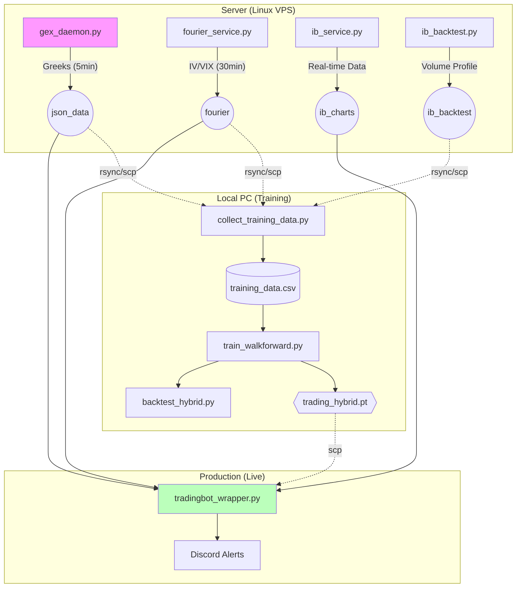

# Guía de Despliegue del Bot de Trading ML

Flujo completo para entrenar y desplegar el `hybrid_model`: generación de datos → entrenamiento local → backtesting → despliegue en producción.

---

## Índice

1. [Arquitectura del Sistema](#1-arquitectura-del-sistema)
2. [Generación de Datos en Servidor](#2-generación-de-datos-en-servidor)
3. [Descargar Datos al PC Local](#3-descargar-datos-al-pc-local)
4. [Entrenamiento del Modelo (Local)](#4-entrenamiento-del-modelo-local)
5. [Backtesting del Modelo](#5-backtesting-del-modelo)
6. [Despliegue en Producción](#6-despliegue-en-producción)
7. [Alertas de Discord](#7-alertas-de-discord)
8. [Monitoreo y Logs](#8-monitoreo-y-logs)

---

## 1. Arquitectura del Sistema



---

## 2. Generación de Datos en Servidor

### 2.1 Servicios que Deben Estar Corriendo

Estos servicios generan los datos que el modelo necesita:

| Servicio | Output | Frecuencia |
|----------|--------|------------|
| `gex_daemon.py` | `json_data/{TICKER}_0dte_ExposureData_*.json` | Cada 5 min |
| `fourier_service_fast.py` | `fourier/fourier_data_{TICKER}_*.json` | Cada 30 min |
| `ib_service.py` | `ib_charts/ib_data_{TICKER}_{DATE}.json` | Tiempo real |

```bash
# Verificar que los servicios estén corriendo
ssh usuario@servidor
pgrep -af gex_daemon
pgrep -af fourier_service
pgrep -af ib_service

# Si no están corriendo, iniciarlos:
cd /home/Option-Greeks-Plotting-Discord-Bot
nohup python services/gex_daemon.py > logs/gex_daemon.log 2>&1 &
nohup python services/fourier_service_fast.py > logs/fourier.log 2>&1 &
nohup python services/ib_service.py > logs/ib_service.log 2>&1 &
```

### 2.2 Generar Datos Históricos de IB (Para Entrenamiento)

El script `ib_backtest.py` genera datos históricos con **Volume Profile** para los últimos N días:

```bash
# En el servidor
cd /home/Option-Greeks-Plotting-Discord-Bot
python backtest/ib_backtest.py

# Output: ib_backtest/ib_data_{TICKER}_{YYYYMMDD}.json
# Contiene: IB range, Volume Profile (VPOC, VAH, VAL), candles 1-min
```

> [!IMPORTANT]
> Ejecuta `ib_backtest.py` antes de descargar datos para asegurar que tienes suficiente historial.

---

## 3. Descargar Datos al PC Local

### 3.1 Carpetas a Descargar

| Carpeta | Contenido | Uso |
|---------|-----------|-----|
| `json_data/` | Greeks exposure cada 5 min | Features principales del modelo |
| `fourier/` | IV, VIX, análisis Fourier | Features de volatilidad |
| `ib_backtest/` | IB histórico + Volume Profile | Features de structure |

### 3.2 Comandos de Descarga

```bash
# Crear estructura local
mkdir -p ./trading_data/{json_data,fourier,ib_backtest}

# Descargar Greeks (puede ser grande, últimos 30 días ~2GB)
rsync -avz --progress kripta:/home/Option-Greeks-Plotting-Discord-Bot/json_data/ ./trading_data/json_data/

# Descargar Fourier/IV
rsync -avz --progress kripta:/home/Option-Greeks-Plotting-Discord-Bot/fourier/ ./trading_data/fourier/

# Descargar IB histórico (contiene Volume Profile)
rsync -avz --progress kripta:/home/Option-Greeks-Plotting-Discord-Bot/ib_backtest/ ./trading_data/ib_backtest/
```

### 3.3 Configurar Paths Locales

Crear archivo `.env` en tu proyecto local:

```env
# Windows paths (usar forward slashes o doble backslash)
GREEK_DATA_DIR=C:/Users/TuUsuario/trading_data/json_data
FOURIER_DIR=C:/Users/TuUsuario/trading_data/fourier
IB_CHARTS_DIR=C:/Users/TuUsuario/trading_data/ib_backtest
IB_BACKTEST_DIR=C:/Users/TuUsuario/trading_data/ib_backtest
```

---

## 4. Entrenamiento del Modelo (Local)

### 4.1 Requisitos

```powershell
# PyTorch con CUDA (RTX 30xx/40xx/50xx)
pip3 install torch torchvision torchaudio --index-url https://download.pytorch.org/whl/cu128

# Verificar GPU
python -c "import torch; print('CUDA:', torch.cuda.is_available(), '|', torch.cuda.get_device_name(0))"
```

### 4.2 Generar Dataset de Entrenamiento

Para entrenar, primero necesitas recopilar datos históricos procesados:

```powershell
cd Gex-Dashboard-Live

# Generar CSV con todos los datos disponibles (p.ej. últimos 365 días)
# Target 0.4% (0.004) para filtrar movimientos pequeños
python neural/collect_training_data.py --output training_data.csv --days 365

# Output: training_data/training_data.csv
```

**Verificar distribución de clases:**
```powershell
python -c "
import pandas as pd
df = pd.read_csv('training_data/training_data.csv')
print(f'Total samples: {len(df):,}')
print(df['target'].value_counts())
"
```

### 4.3 Entrenar con Walk-Forward (Recomendado)

Walk-forward previene el *lookahead bias* (predecir el pasado con datos del futuro) y genera métricas más realistas.

```powershell
python neural/train_walkforward.py --data training_data/training_data.csv --model-size micro --epochs 100 --batch-size 512 --lr 0.0005 --train-months 0 --test-months 0

# Output:
#   models/trading_hybrid_wf.pt
#   models/hybrid_normalizer_wf.npz
```

### 4.4 Entrenamiento Tradicional (Alternativa Rápida)

Si prefieres u método más simple (hold-out validation):

```powershell
python neural/train_hybrid.py --data training_data/training_data.csv --model-size small --epochs 200 --lr 0.001 --weight-decay 0.1 --augment-noise 0.1 --batch-size 1024

# Output:
#   models/trading_hybrid.pt
#   models/hybrid_normalizer.npz
```

---

## 5. Backtesting del Modelo

El backtesting simula cómo habría operado el modelo en el pasado con reglas de gestión de riesgo específicas.

### 5.1 Backtest "Golden" (Configuración Óptima)

Esta es la configuración validada que maximiza el Profit Factor y minimiza el Drawdown:

*   **Threshold 0.5**: Confianza mínima del 50% (el modelo ya es estricto al entrenar con target 0.4%).
*   **Min IV 0.2**: Filtra el 20% de días con menor volatilidad (evita chop).
*   **Max Time 20**: Evita trades que el modelo predice tardarán mucho (lentos).

```powershell
python neural/backtest_hybrid.py --model models/trading_hybrid.pt --data training_data/backtest_trades.csv --threshold 0.5 --target 0.004 --stop 0.004 --max-time 20 --min-iv 0.2

python .\neural\backtest_hybrid.py --threshold 0.5 --uncertainty 120 --max-time 120
```

### 5.2 Verificar Alertas (Simulación Discord)

```powershell
# Verificar Alertas Discord (Simulación: Envía solo 3 alertas para probar)
# Envía alertas de APERTURA y CIERRE al canal configurado
python neural/backtest_hybrid.py --threshold 0.5 --target 0.004 --stop 0.004 --max-time 20 --min-iv 0.2 --discord --limit 3
```

> [!NOTE]
> Esto enviará alertas reales a tu canal de Discord configurado. Úsalo con precaución para no spamear.

---

## 6. Despliegue del Bot de Discord (Producción)

El objetivo es que el bot en vivo opere **exactamente igual** que el backtest "Golden".

### 6.1 Subir Archivos al Servidor

Sube el código y los modelos entrenados:

```bash
# Subir código
scp -r bots/ neural/ deploy/ docs/ usuario@servidor:/home/Option-Greeks-Plotting-Discord-Bot/

# Subir modelo entrenado
scp models/trading_hybrid.pt models/hybrid_normalizer.npz usuario@servidor:/home/Option-Greeks-Plotting-Discord-Bot/models/
```

### 6.2 Configurar `tradingbot_wrapper.py`

He actualizado `bots/tradingbot_wrapper.py` para que use por defecto la configuración "Golden":
*   `MIN_CONFIDENCE = 0.5`
*   `MIN_IV_PCT = 0.2`
*   `MAX_TIME_MINUTES = 20`
*   `Stop Loss = 0.4%`

No necesitas editar nada si ya actualizaste el archivo.

### 6.3 Ejecutar como Servicio (Systemd)

Para que el bot corra 24/7 y se reinicie solo:

1.  **Copiar servicio:**
    ```bash
    sudo cp deploy/gex_bot.service /etc/systemd/system/
    ```

2.  **Recargar y activar:**
    ```bash
    sudo systemctl daemon-reload
    sudo systemctl enable gex_bot
    sudo systemctl start gex_bot
    ```

3.  **Verificar logs en tiempo real:**
    ```bash
    # Ver logs del bot
    sudo journalctl -u gex_bot -f
    
    # O ver archivo de log directo
    tail -f /home/Option-Greeks-Plotting-Discord-Bot/logs/tradingbot_wrapper.log
    ```

### 6.4 Comandos de Control

*   **Reiniciar bot:** `sudo systemctl restart gex_bot`
*   **Parar bot:** `sudo systemctl stop gex_bot`
*   **Ver estado:** `sudo systemctl status gex_bot`

---

## 7. Monitoreo y Logs u Resumen

| Tarea | Comando / Ubicación |
|-------|---------------------|
| **Entrenar** | `python neural/train_hybrid.py --model-size medium` |
| **Backtest** | `python neural/backtest_hybrid.py --threshold 0.5 --min-iv 0.2` |
| **Ver Logs** | `sudo journalctl -u gex_bot -f` |
| **Ver Trades**| `logs/tradingbot_wrapper.log` o canal de Discord |
